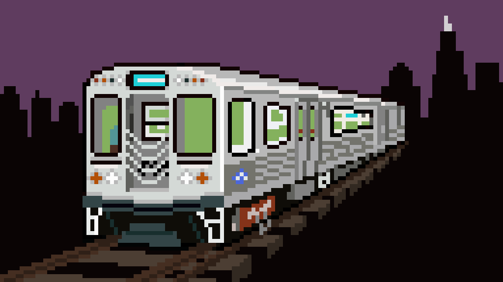

# Hey, I'm Shashank Shekhar 👋

**Backend Engineer · Full Stack Builder · OSS Author · AI Researcher · Community Lead**

  

*"Spiders are the only web developers who love bugs."* 🕷️

---

## About me

I'm a Computer Science (AI) student at **Gautam Buddha University**, building scalable backends, AI-powered platforms, developer tools, and published Python packages. I've presented research at international conferences, shipped a full AI DevOps SaaS, and published **4 packages on PyPI** — all while going deep on **Go, DevOps, and distributed systems**.

I managed **[Hackfed](https://github.com/HackfedCommunity)** — a developer community in Greater Noida — and led web development at GDG On Campus GBU and Microsoft Learn Student Ambassadors.

- 🔭 Currently building → **[zeroo.space](https://zeroo.space)** — AI-Agentic DevOps Infrastructure Platform
- 🧠 Published research → **DCAT** at the 13th International Conference on Microelectronics, Circuits & Systems (Micro 2026)
- 🎤 Presented poster → **1st International Skill Development & Research Innovation Summit 2025**
- 📦 Published → **4 Python packages** on PyPI
- 🌱 Learning → **Go · Kubernetes · Scalable system design**
- ✍️ Writing at → **[shashaaankkkkk.medium.com](https://shashaaankkkkk.medium.com)**
- 🌐 Portfolio → **[shashaaankkkkk.me](https://shashaaankkkkk.me)**

---

## 🔬 Research & presentations

| Type          | Title                                                                                                                                    | Venue                                                                                | Year |
| ------------- | ---------------------------------------------------------------------------------------------------------------------------------------- | ------------------------------------------------------------------------------------ | ---- |
| 📄 **Paper**  | [DCAT — Dual CNN Encoder with Cross-Attention Transformer Decoder for Enhanced Image Captioning](https://github.com/shashaaankkkkk/DCAT) | 13th International Conference on Microelectronics, Circuits and Systems (Micro 2026) | 2026 |
| 🪧 **Poster** | Leveraging AR/VR for Immersive Skill Building Experiments and Future Skills — Aligning Education with Industry 5.0                       | 1st International Skill Development & Research Innovation Summit                     | 2025 |

**[DCAT](https://github.com/shashaaankkkkk/DCAT)** combines a dual CNN encoder with a cross-attention transformer decoder to generate richer, more contextually accurate image captions. The dual-encoder captures multi-scale visual features while the cross-attention mechanism improves semantic alignment between visual and textual representations.

## 🚀 The Zero universe

> A growing ecosystem of AI-powered tools and infrastructure built under one vision.

| Project | What it does | Stack | Status |
|---|---|---|---|
| [🌌 zeroo.space](https://zeroo.space) | AI-Agentic DevOps — manage AWS, GCP & Azure via natural language | Next.js 14 · TypeScript · Tailwind · shadcn/ui · Framer Motion | 🟡 Waitlist |
| [⚡ ZeroAPI](https://github.com/shashaaankkkkk/ZeroAPI) | No-code backend builder with GPT-powered AI agents & embeddable chatbots | JavaScript | 🟢 Active |
| [🖼️ ZeroWallpaper](https://github.com/shashaaankkkkk/ZeroWallpaper) | Terminal wallpaper manager — live preview, tag filtering, auto-rotation | Python · Textual | 🟢 PyPI |
| [🎨 zeroUI](https://github.com/shashaaankkkkk/zeroUI) | Companion UI component library for the Zero ecosystem | JavaScript | 🔵 WIP |

---

## 📦 Python packages on PyPI

| Package | Description | Install | Version | Total Downloads |
|---|---|---|---|---|
| [🖼️ zerowallpaper](https://pypi.org/project/zerowallpaper/) | Terminal wallpaper engine — stream, filter & set wallpapers from your terminal | `pip install zerowallpaper` |  |  |
| [🌐 lanlord](https://pypi.org/project/lanlord/) | Keyboard-first network IP & port scanner with Textual TUI | `pip install lanlord` |  |  |
| [😺 meow-redis-ratelimiter](https://pypi.org/project/meow-redis-ratelimiter/) | Framework-agnostic Redis rate limiter for Flask, Django, FastAPI | `pip install meow-redis-ratelimiter` |  |  |
| [📅 gbu-timetable](https://pypi.org/project/gbu-timetable/) | Terminal timetable viewer for Gautam Buddha University | `pip install gbu-timetable` |  |  |
---

## 🛠️ Other notable projects

| Project | What it does | Stack |
|---|---|---|
| [📷 raspi-camera-feed](https://github.com/shashaaankkkkk/raspi-camera-feed) | Near-zero-latency MJPEG live streaming from Raspberry Pi Camera | Python · Flask · PiCamera2 |
| [🏥 Svaasthy](https://github.com/shashaaankkkkk/Svaasthy-AI_based-patient-health-system) | AI-based IoT patient health monitoring — vitals, diagnosis & web portal | Django · SCSS |
| [🐾 PawsitiveAdoptionHub](https://github.com/shashaaankkkkk/PawsitiveAdoptionHub) | Pet adoption platform built in 24h at Geekathon Hackathon 2023 | Django · Bootstrap |
| [🔌 Django REST API](https://github.com/shashaaankkkkk/Django-REST-API) | Full-featured RESTful API reference implementation with Django + DRF | Python · Django |

---

## 🧰 Tech stack

**Backend & systems**

**Frontend**

**Data & infra**

**AI / ML**

---

## 📊 GitHub stats

---

## 🤝 Community & leadership

- 🏗️ **Community Managed** — [Hackfed](https://github.com/HackfedCommunity), Greater Noida
- 👨‍💻 **Web Dev Lead** — GDG On Campus, Gautam Buddha University (2024–2025)
- 🧑‍🏫 **Web Developer Lead** — Microsoft Learn Student Ambassador, GBU (2024)
- 🤖 **AI Summer Trainee** — Samsung Innovation Campus (2024)
- ☁️ **Member** — AWS Cloud Club GBU

---

## 📬 Connect

---

Building the Zero universe · 4 PyPI packages · Published researcher · Poster presenter · Open to backend & full-stack roles 🚀

